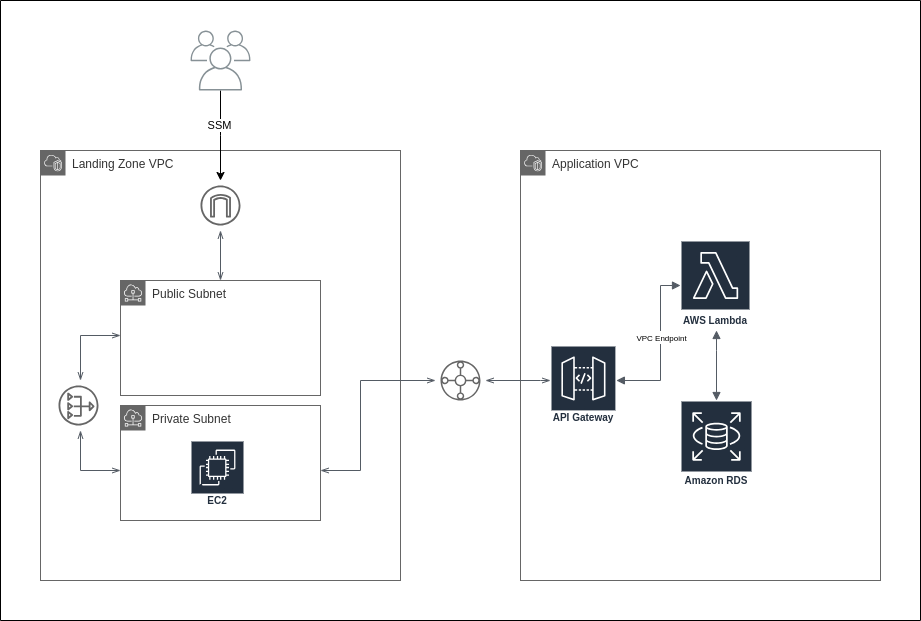

# Infrastructure Architecture Overview
## Architecture Diagram

In this project, I set up two Virtual Private Clouds (VPCs) – the Landing Zone and the Application Zone.

## Landing Zone VPC
In the Landing Zone VPC, there are two subnets: one private and one public. In the private subnet, there's an AWS EC2 instance for API testing. To connect to this instance from a local environment, I arranged a Virtual Private Cloud (VPC) Endpoint for AWS Systems Manager (SSM).

External traffic comes through the Internet Gateway into the public subnet. Using Network Address Translation (NAT), the traffic then goes to resources in the private subnet for controlled and secure data flow.

## Application Zone VPC
In the Application Zone VPC, I put a Lambda Function to handle API requests. I also set up an API Gateway as a reverse proxy, directing requests to the Lambda Function and serving as the invoker. As the Application Zone is a private VPC, secure access to the API Gateway is managed through a VPC Endpoint.
